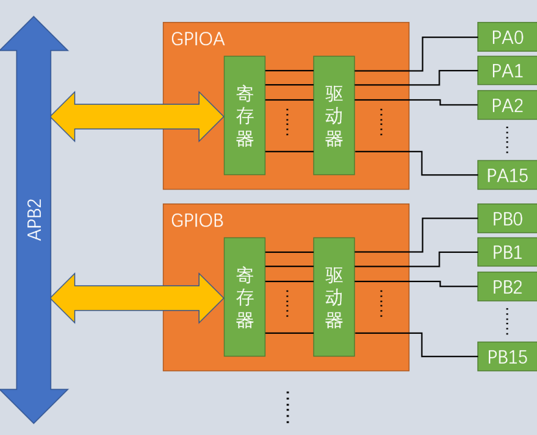
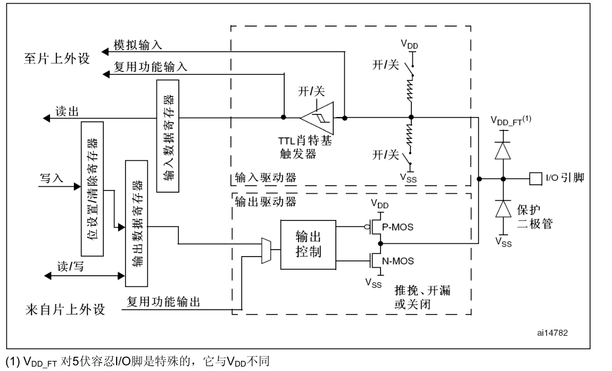
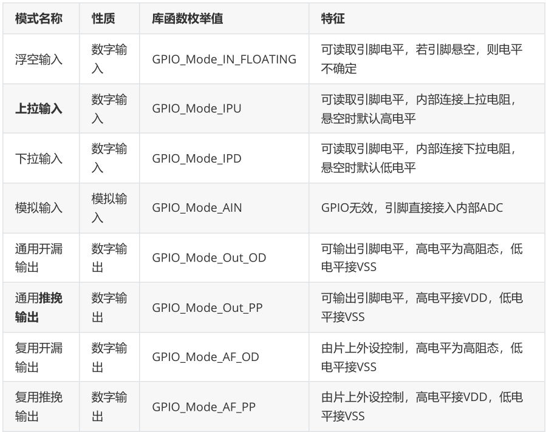
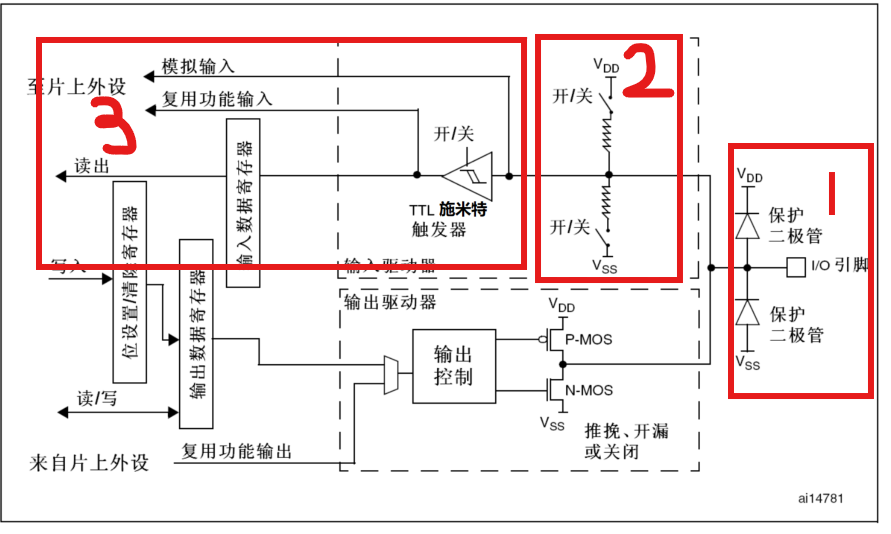
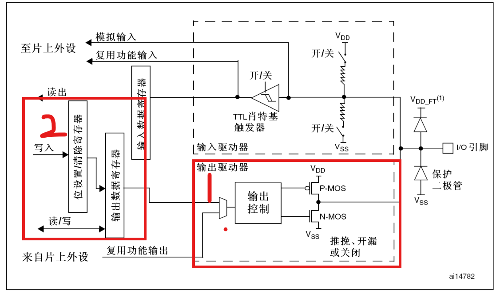
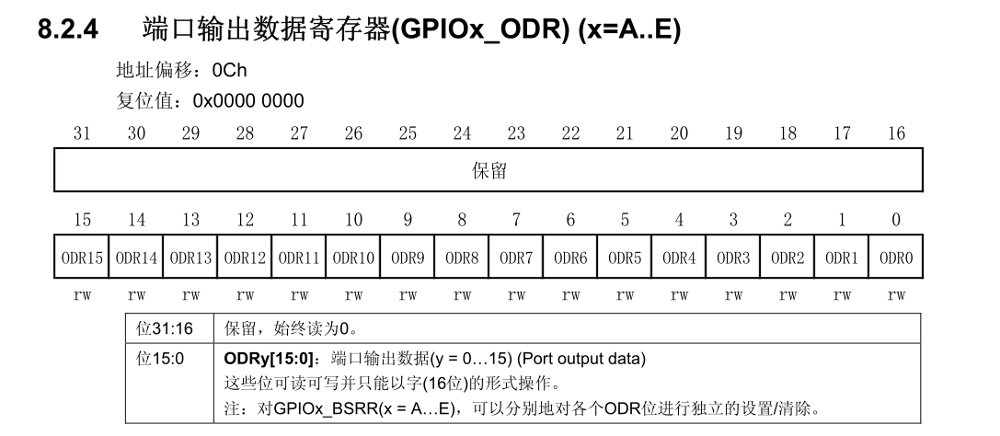
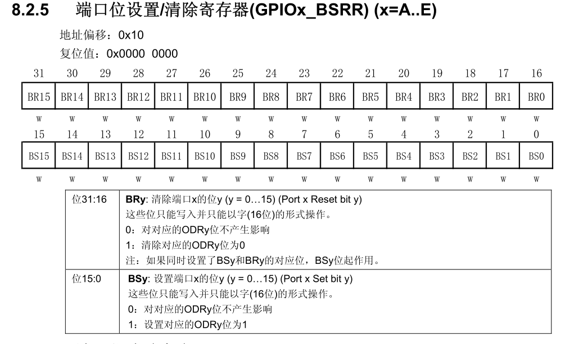

# GPIO介绍  
>主要是讲解stm32f10xxx系列的  
## 1 系统结构  
  
图中可以看见GPIOx是挂在APB2总线上的，每个GPIOx内部都由寄存器、驱动器构成最后连接相应端口。  
## 2 I/O端口结构  
   
这是官方提供的结构图。  
## 3 GPIO的几种模式  
   
>接下来我会按照I/O端口结构来讲解GPIO的几种模式。  
## 3.1输入模式  
首先先来分析一下输入部分的结构。  
   
-
- 1.保护二极管：防止外部电压过大或过小。当电压大于VDD时单向二极管导通，VDD来吸收这个高电压。当电压低于VSS时单向二极管导通，VSS来吸收这个低电压。
- 2.上/下拉电阻：通过配置GPIOx_CRL、GPIO_CRH来控制上下拉电阻开关闭合。当开启上拉电阻的时候引脚电平默认为高电平；当开启下拉电阻的时候引脚默认为低电平；当两个都不启用的时候，此时处于浮空状态，引脚电平不确定。
- 3.输入数据寄存器：在输入数据寄存器之前有一个施密特触发器，其作用是将外部输入电平进行降噪，整流得到方波信号（值为0、1）。如果使用的是GPIO的普通模式电平便会存入输入数据寄存器，cpu读取。如果是复用GPIO输入,此时不由cpu读取因此就不会用到输入寄存器，而是由片上外设直接读取。  
### 3.1.1 浮空输入  
数字输入、上下拉电阻都关闭、引脚悬空电平不确定。  
### 3.1.2 上拉输入  
数字输入、开启上拉电阻，引脚电平默认为高。  
### 3.1.3 下拉输入  
数字输入、开启下拉电阻，引脚电平默认为低。  
### 3.1.4 模拟输入  
模拟信号，通过官方提供的图可以看出模拟信号不会经过施密特触发器，GPIO无效直接接入内部ADC。    

## 3.2 输出模式  
我们先来分析其结构。  
  
- 1.输出驱动：我们可以看见其由输出控制器与双MOS管组成。输出不同的电平对应的MOS管就会导通，输出相应的电平。  
- 2.输出数据寄存器：双MOS管的输入信号是由数据寄存器提供（GPIOx_ODR）的。修改它就可以修改对外输出。  
- 3。；置位/复位寄存器（GPIOx_BSRR）：想要修改输出数据寄存器就是修改GPIOx_BSRR。使用置位则输出1，复位则输出0。   
只有通用GPIO模式才会由CPU控制从而使用这两个寄存器，复用模式由片上外设控制。   
以下为官方手册内容：
 
   
简单说明：上面的数字都是0-15，分别对应了Px0-Px15这几个I/O端口。  
类似于--位31：16：代表从第31位到第16位。  
### 3.2.1通用开漏输出  
数字输出，此时双MOS管中P-MOS管始终关闭（注意：P-MOS管的前面比N-MOS管多一个空心圆圈空心?，代表取反），只可以使用N-MOS管。  
当输出低电平的时候N-MOS管导通，此时输出低电平。  
当输出高电平的时候N-MOS管不导通，此时既不输出高电平也不熟输出低电平，呈现高阻态。  
### 3.2.2 通用推挽输出  
数字输出，此时双MOS管都可以使用。  
当输出高电平的时候，P-MOS管导通，输出高电平。  
当输出低电平的时候，N-MOS管导通，输出低电平。  
### 3.2.3 复用开漏输出  
数字输出，此时不由cpu控制而是由片上外设控，此时直接进入输出驱动器。其余逻辑相同。 
### 3.2.4  复用推挽输出
同上。    
  
# 4示例  
>理论知识大概讲完了，现在来看一下如何操作代码，我们以最简单的点灯为例。  
## 4.1 代码
```c    
//main.c
#include "stm32f10x.h"                  // Device header
#include "GPIO.h"

 
int main(void){

	GPIO_My_Init();
	

	 while(1){
		
			
	 }
}

```    
```c
#ifndef _GPIO_MY_H
#define _GPIO_MY_H


void GPIO_My_Init(void);

#endif

```
```c
//gpio.c
#include "stm32f10x.h"


void GPIO_My_Init(){
    //时钟使能
    RCC_APB2PeriphClockCmd(RCC_APB2Periph_GPIOA,ENABLE);
    //GPIO初始化
    GPIO_InitTypeDef GPIO_InitStruct;
    GPIO_InitStruct.GPIO_Mode=GPIO_Mode_Out_PP;
    GPIO_InitStruct.GPIO_Pin=GPIO_Pin_0;
    GPIO_InitStruct.GPIO_Speed=GPIO_Speed_50MHz;
    GPIO_Init(GPIOA,&GPIO_InitStruct);   

	GPIO_SetBits(GPIOA,GPIO_Pin_0);
}

```  
## 4.2 现象  
   
## 4.3 分析  
这里我使用的是**通用推挽输出模式**因为它既可以输出低电平也可以输出高电平。`    GPIO_InitStruct.GPIO_Mode=GPIO_Mode_Out_PP;
` 。
`	GPIO_SetBits(GPIOA,GPIO_Pin_0);
`:设置输出高电平点亮。如果是低电平点亮就是
`	GPIO_ResetBits(GPIOA,GPIO_Pin_0);
`
