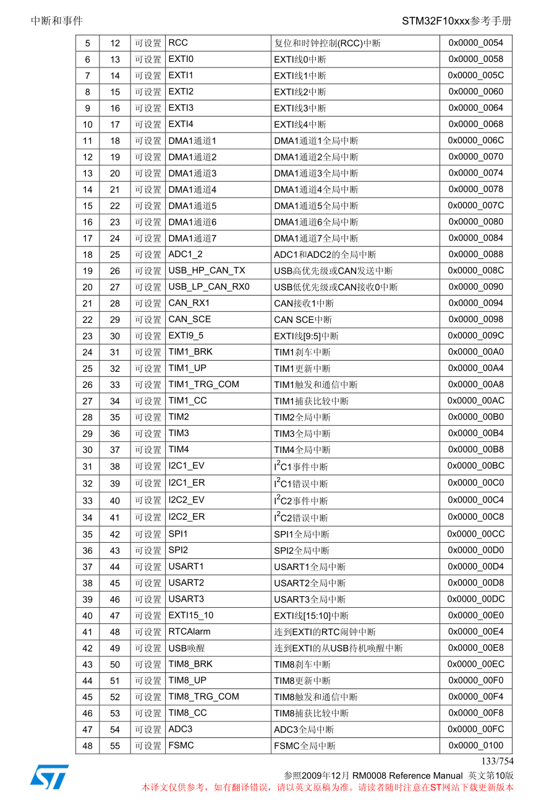
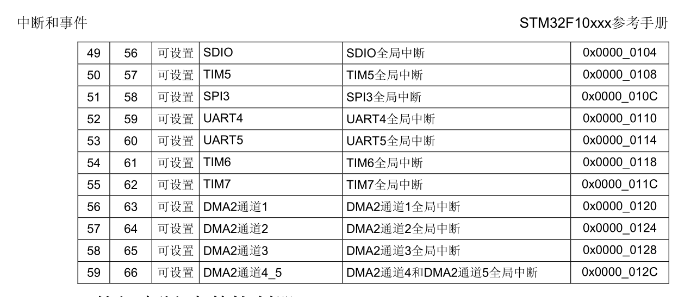
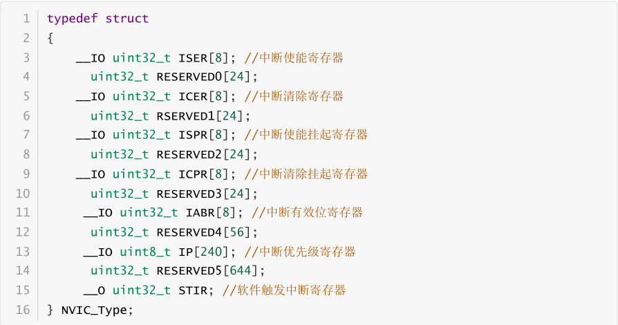
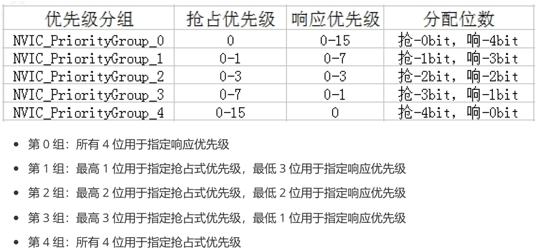

# 中断系统  
## 1 中断介绍  
CPU在执行程序的时候，由于某种随机事件（内部或是外部）CPU暂时停止运行程序，转而去执行一段特殊的服务程序函数来处理这个中断事件。处理完毕再回到暂停的地方继续往下执行。  
## 2 NVIC介绍  
它的中文名叫**嵌套向量中断控制器**属于M3内核的一个外设，控制芯片中断的相关功能。ARM公司为NVIC预留很多功能，但ST公司对其做了裁剪，我们现在用的stm32f103芯片的内核就是裁剪后的结果，NVIC数量有所减少。  
通过查阅ST官方手册我们可以知道具体分配给了哪些外设：  

  
NVIC控制芯片的中断功能，所以有许多的寄存器，再固件库core_cm3.h文件内定义了一个NVIC结构体，里面定义了相关寄存器：  
    
我们需要知道的是ISER、ICER、IP这三个寄存器。  
ISER:中断使能寄存器。  
ICER：中断清除寄存器。  
IP:中断优先级寄存器。  
## 中断优先级
通过上面那张图我们可以知道stm32f103芯片有60个中断通道（0-4没有截取展示）每个通道都有自己的中断优先级控制字节（8位，理论上每个中断可以设置为0-255，值越大优先级越小。但stm32f103只是使用高4位）。  
我们讨论高4位的使用，这4位又被分成2组：抢占优先级、响应优先级。抢占优先级的优先级高于响应优先级，相同时再比较响应优先级。如果说响应优先级也相同，那么系统将按照中断表中的排序来决定先执行哪个，靠前的先执行。  
优先级分组：  
  
## 中断配置  
后面外部中断，定时器中断会具体展示。  
    
