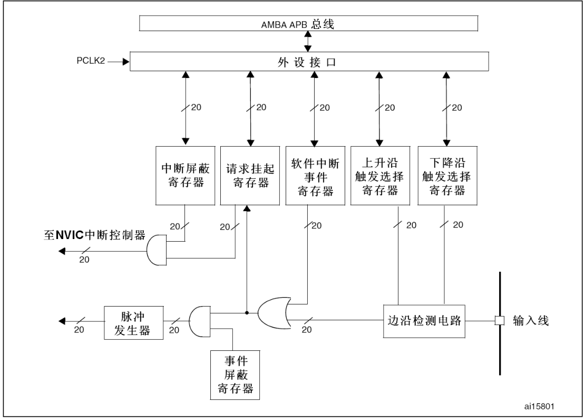
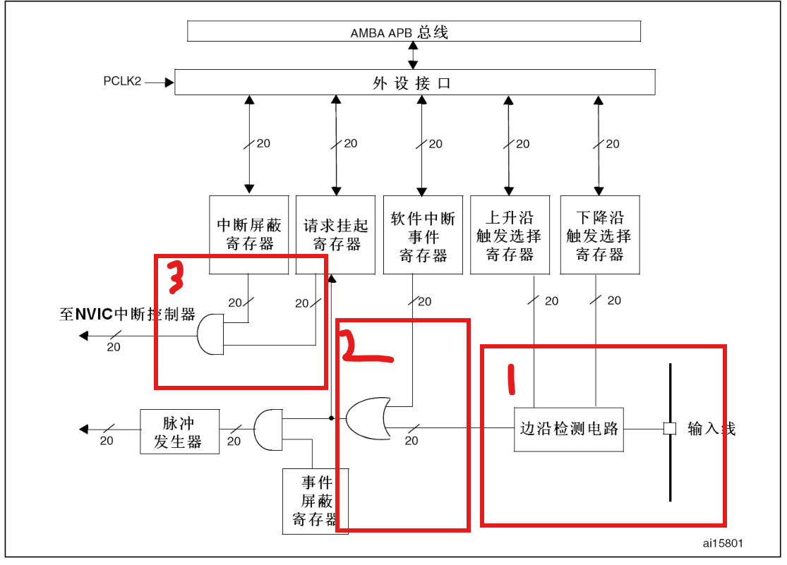
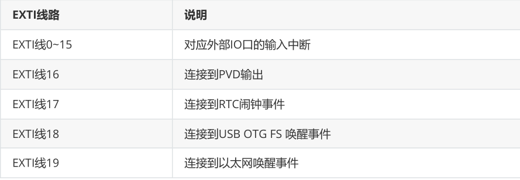
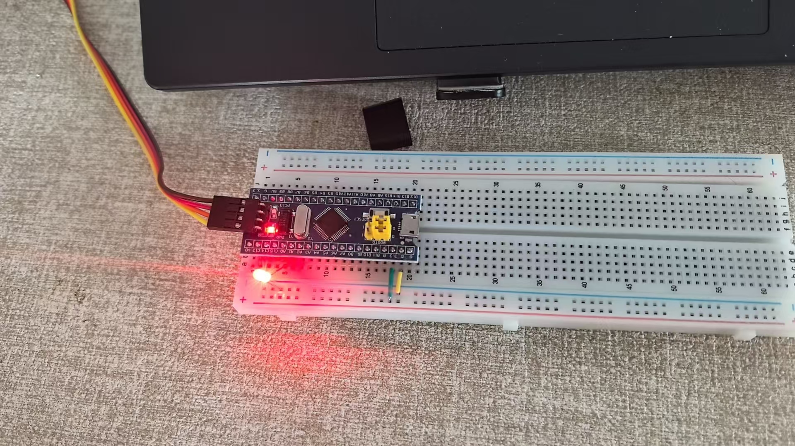

# 外部中断  
## 1 外部中断介绍   
EXTI监测指定GPIO口的电平变化，如果发生变化EXTI向NVIC发出中断申请，经过NVIC裁决之后就会中断CPU主程序，执行EXTI对应的中断程序。  
- 支持的触发方式：上升沿/下降沿/双边沿/软件触发  
- 支持的GPIO口：所有GPIO口，但相同的Pin不可以同时使用(比如：PA0,PB0不可以同时使用)  
- 通道数：16个GPIO_Pin、PVD输出、RTC闹钟、USB唤醒、以太网唤醒  
- 触发响应方式：中断响应、事件响应  
## 2 EXTI结构图  
  

先解释一下每个线傍边的20是什么，前面说过stn32f103一共有20根EXTI线，每个外部中断都对应一根线路与寄存器。  
我们知道响应方式分为：事件响应、中断响应。    
  

- 中断响应：首先在边沿检测电路中通过事先配置好的边沿触发选择寄存器来判断是否产生外部中断（上升沿触发就配置对应寄存器，下降沿一样，如果是双边沿就都配置）；接着经过一个或门，或门的另外一个线路来自软件中断事件触发器（该寄存器人为模拟外部中断已经触发，此时无需在经过边沿检测电路）；再到请求挂起寄存器（当中断发生该寄存器写1，当中断结束要手动清零）；最后经过一个与门，与门另外一根线来自中断屏蔽寄存器（当其写1时才可以发送中断请求）。  
- 事件响应：分析思路与上面一模一样，只不过它产生的是脉冲信号，直接作用于片上外设，不经过CPU处理。  
>我们只要使用中断响应，下面都是围绕这个展开。  
## 3 外部中断/事件线  
20根线分别对应：  
  
**注意**：为了使中断线正确映射到相应端口，AFIO时钟要先使能。  
```c
RCC_APB2PeriphClockCmd(RCC_APB2Periph_AFIO,ENABLE); 
```  
## 4 示例（EXTI配置步骤）    
>通过按钮控制LED亮灭
```c
//led.h
#ifndef _LED_H
#define _LED_H


void LED_Init(void);

#endif
```  
```c
//led.c
#include "stm32f10x.h"


void LED_Init(){
    //时钟
    RCC_APB2PeriphClockCmd(RCC_APB2Periph_GPIOA,ENABLE);
    
    GPIO_InitTypeDef GPIO_InitStruct;
    GPIO_InitStruct.GPIO_Mode=GPIO_Mode_Out_PP;
    GPIO_InitStruct.GPIO_Pin=GPIO_Pin_0;
    GPIO_InitStruct.GPIO_Speed=GPIO_Speed_50MHz;
    GPIO_Init(GPIOA,&GPIO_InitStruct);
    
    GPIO_SetBits(GPIOA,GPIO_Pin_0);//PA0输出高电平

}

```  
```c
//button.h
#ifndef _BUTTON_H
#define _BUTTON_H
#include "GPIO.h"

void Button_Init(void);
void Led_On(void);
void Led_Off(void);
void Led_Toggle(void);

#endif

```  
>下面是重点，注释即为配置步骤  
```c
#include "stm32f10x.h"
#include "button.h"
#include "Delay.h"

void Button_Init(void){
    //打开时钟
    RCC_APB2PeriphClockCmd(RCC_APB2Periph_GPIOA, ENABLE);//使能GPIOA时钟
    RCC_APB2PeriphClockCmd(RCC_APB2Periph_AFIO, ENABLE);//使能AFIO时钟

    //GPIO初始化
    GPIO_InitTypeDef GPIO_InitStructure;
    GPIO_InitStructure.GPIO_Pin = GPIO_Pin_1;//按钮接PA1
    GPIO_InitStructure.GPIO_Mode=GPIO_Mode_IPU;//上拉输入,按钮另外一端接GND
    GPIO_InitStructure.GPIO_Speed=GPIO_Speed_50MHz;
    GPIO_Init(GPIOA,&GPIO_InitStructure);

    //将中断线Line1连接到PA1引脚
    GPIO_EXTILineConfig(GPIO_PortSourceGPIOA, GPIO_PinSource1); 

    //配置NVIC
    //中断分组（实际开发中写在main.c中）
    NVIC_PriorityGroupConfig(NVIC_PriorityGroup_2);//设置中断分组2：2位抢占优先级，2位响应优先级

    //NVIC通道配置
    NVIC_InitTypeDef NVIC_InitStructure;
    NVIC_InitStructure.NVIC_IRQChannel = EXTI1_IRQn;//外部中断通道（这个是官方写好的，所以中断通道要自己去查）
    NVIC_InitStructure.NVIC_IRQChannelPreemptionPriority = 1;//抢占
    NVIC_InitStructure.NVIC_IRQChannelSubPriority = 1;//响应
    NVIC_InitStructure.NVIC_IRQChannelCmd = ENABLE;//使能
    NVIC_Init(&NVIC_InitStructure);

    //配置外部中断EXTI
    EXTI_InitTypeDef EXTI_InitStructure;
    EXTI_InitStructure.EXTI_Line = EXTI_Line1;//中断线1
    EXTI_InitStructure.EXTI_Mode = EXTI_Mode_Interrupt;//中断模式
    EXTI_InitStructure.EXTI_Trigger = EXTI_Trigger_Falling;//下降沿触发
    EXTI_InitStructure.EXTI_LineCmd = ENABLE;//使能中断线
    EXTI_Init(&EXTI_InitStructure);

}

//写外部中断函数(中断服务函数名官方已经帮我们写好了不可以自己随便写要到startup_stm32f10x_md_vl.s里面找)
void EXTI1_IRQHandler(void){
    if(EXTI_GetITStatus(EXTI_Line1) != RESET){//判断中断线1是否发生中断
        Delay_ms(10);//按键消抖
        while(GPIO_ReadInputDataBit(GPIOA, GPIO_Pin_1) == 0);
        Delay_ms(10);//按键消抖
        //在这里写中断处理函数
        Led_Toggle();//调用LED翻转函数
    
        //清除中断标志位
        EXTI_ClearITPendingBit(EXTI_Line1);
    }
}  

void Led_On(){
    GPIO_SetBits(GPIOA, GPIO_Pin_0);//PA0输出高电平
}

void Led_Off(){
    GPIO_ResetBits(GPIOA, GPIO_Pin_0);//PA0输出低电平
}

void Led_Toggle(){
    
    if(GPIO_ReadOutputDataBit(GPIOA,GPIO_Pin_0)){
        Led_Off();
    }
    else{
        Led_On();
    }

    
}

```  
```c
//main.c
#include "stm32f10x.h"                  // Device header
#include "button.h"
#include "GPIO.h"
#include "Delay.h"

 
int main(void){

	LED_Init();
	Button_Init();
	
	 while(1){
		
	 }
}

```  
## 5 现象  
[](./assets/demo.mp4)
