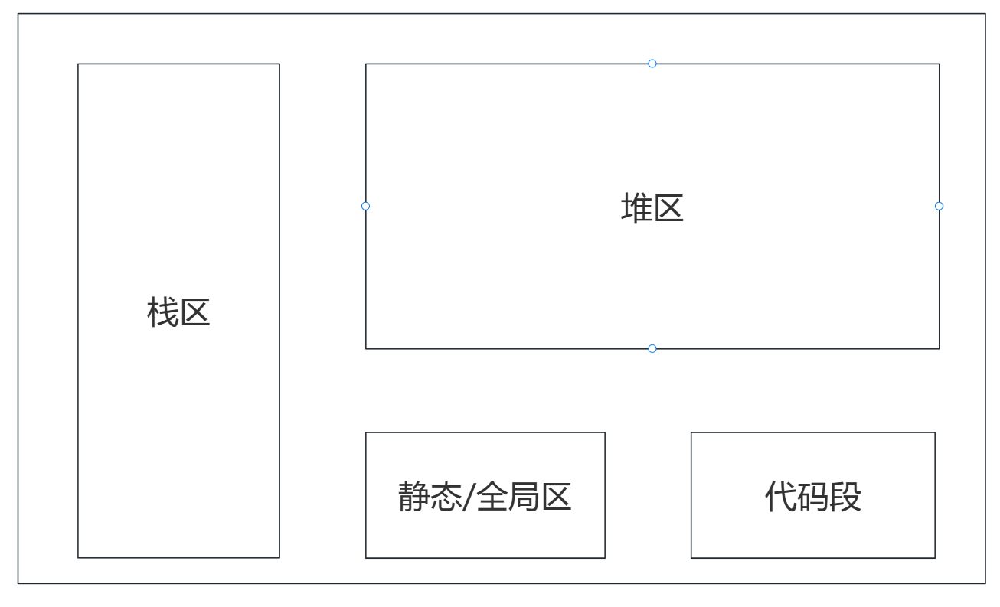
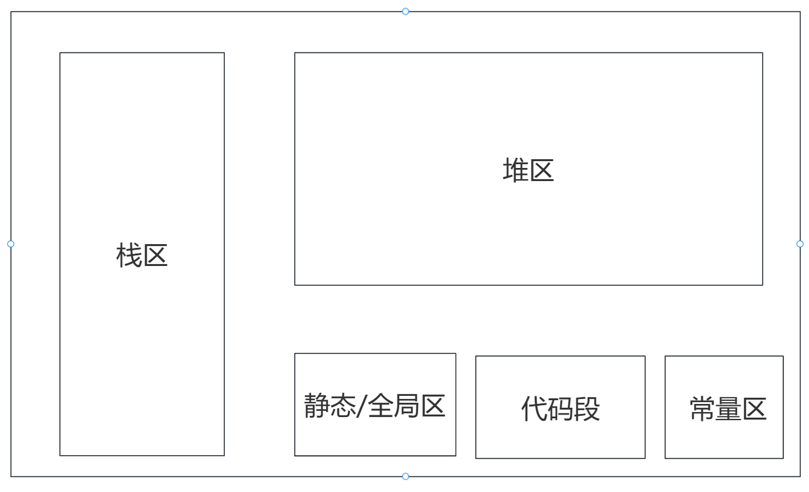
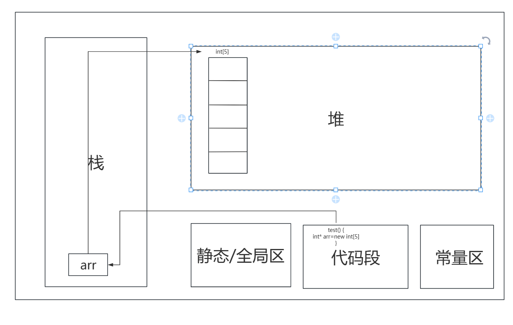
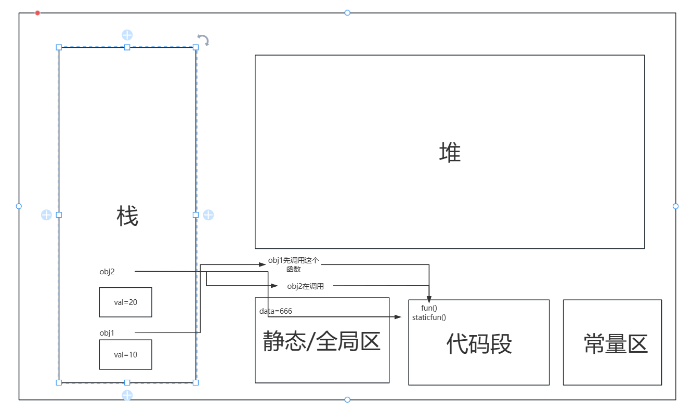
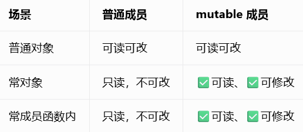

# C++自主学习  

## 1.1 C++程序示例  
```cpp  
#include<iostream>  
	int mian(){  
	std::cout<<"hello world";  
	return 0;  
}  
```  
### 1.1.1 main函数  
C++文件的扩展名为.cpp,每个C++程序中有且只有一个main()的主函数
，该函数是程序执行的入口。  
### 1.1.2 使用cout输出  
&nbsp;&nbsp;&nbsp;&nbsp;首先我们要知道`#include <iostream>`
,这个的话我习惯叫做“引入标准的输入输出流的头文件”
，cout即是向控制台或终端输出文本和数据。  
&nbsp;&nbsp;&nbsp;&nbsp;`<<`则是表示将某个数据发送给cout，该符号指出了信息流动的路径
。（后续我们还会接触到`cin`其作用表示键盘输入，逻辑与`cout`类似）  
### 1.1.3&nbsp;命名空间  
`std`是C++标准库的命名空间，包含大量常用的类，函数，对象等。  
`namespace`是一种组织代码的方式，主要用于解决命名冲突的问题。  
简单来说，你可以将 namespace 想象成一个容器或者一个范围，在这个范围内定义的变量、函数、类等
标识符不会与容器外同名的标识符产生冲突。对于大型项目或者使用多个库的情况特别有用，不会因为
使用相同的标识符而引发错误。  
### 1.1.4&nbsp;  返回语句  
`return 0`表示结束程序运行。如果在某一个函数内单独出现了`return`则表示结束这个函数  
    
### 1.1.5&nbsp;换行符  
`endl`在输出打印时我们一般用这个来表示换行

---
现在我们对C++已经有了一个初步的印象，接下我们开始来正式学习C++  

---  
  ## 2数据类型与变量定义
  ### 2.1整形  
    


  整形在这里分为**短整型**,**长整型**，**长长整形**，**整形**  
  **整形int**：4字节  
  **短整型short**：2字节  
  **长整型long**：window为4字节，Linux32位为4字节，Linux64位为8字节  
  **长长整形long long**：8字节  
  ```cpp  
  int a;
  short b;
  long long c;
  long d;

  ```
  ### 2.2浮点型  
  * 单精度 float  4字节  
*  双精度 double 8字节    
```cpp  
float a;
double b;
```
	  
### 2.3字符型  
**字符型char**  1个字节  
主要：我们字符类型是指单个的数字，字母用单引号括起来  
比如：'a' 'A' '0' '\n'
**注意：字符型可以通过ASCLL表与整形相互转换**  
```cpp
char c1='1';
char c2='a';
char c3='\n';//换行转义字符（后面会说）
```
### 2.4布尔型  
**bool**  1个字节，其返回值为true(1)或者false(0)    
```cpp  
bool flag1=true;
bool flag2=false;
bool flag3;
```
### 2.5字符串  
**string** 24个字节，不管字符串里面存的数据有多少其本身占24个字节  
```cpp
string s="1";
string s2="a";//上面这两个与字符型的区别看上去是符号不同一个为单引号一个为双引号，但究其本质，是因为字符串的结尾会自带一个\0来充当结束符号
string s3="12345";
string s4="asdfg";
string s5="张三";

```    
在C++中，它为我们提供了string类型来修饰字符串，而不是像C语言用字符数组来体现字符串。既然提到了字符串，我来说说它的一些
基本用法。  
#### 2.5.1字符串拼接  
我这边直接用代码体现  
```cpp
string s="hello";
string s2="world";
string s3=s+s2;//输出为helloworld

```


看了这段代码之后应该就对string的拼接有了一个直观的理解。除此之外，我们要注意在string的拼接概念里**只有+**没有其他符号
#### 2.5.2字符串重载  
string还重载了= > < >= <= ==这几个运算符。大家可以理解为比较两个字符串的大小关系，那么比较规则是什么呢？  
如下：  
1.	从第一个字符开始，依次对比两个字符串对应位置字符的 ASCII 数值；
2.	找到第一对不相同的字符，ASCII 更大的那整个字符串就更大，直接结束比较；
3.	如果前面字符全部相同，长度更长的字符串更大；
4.	== 要求两个字符串每个字符、长度完全一致才相等。
    
	  
   
 
 ## 3常量  
常量是程序在运行的过程中，其值不能改变的量，称之为常量。  （下面我先简单说一下常量的概念，后面还会补充指针，引用等方面的常量知识）  
  
### 3.1字面值常量  
常量分为整型常量、实型常量、字符常量、字符串常量和其他常量。  
-字符串字面量（如  "Hello" ）存储在只读的文字常量区（或称为常量池），存储在这个区域中的数据不能被程序修改。   
-整型、浮点型和其他基本类型的字面量常量通常在编译时就被嵌入到代码段中，作为指令的一部分，而不是单独分配内存。  
-其他常量：
布尔常量，一个true，一个false，两个取值。
枚举常量，枚举型数据中定义的数据也都是常量。  

### 3.2#define宏定义常量      
`#define` 宏定义实际上并不分配内存，宏定义是在编译预处理阶段由预处理器执行的文本替换操
作。也就是说，宏定义在编译过程开始之前就已经完成了文本替换，因此宏定义本身并不在程序的
运行时内存中占据任何空间。  
格式如下：  
```cpp
#define 常量名 常量值
```  
所谓文本替换就是将程序中所有出现你自己定义的**常量名**的地方自动换成**常量值**  
### 3.3const    
一句话解释就是用来修饰变量的语句，表示定义一个常量。  
```cpp
const 数据类型 常量名=常量值；//
```  
使用`const`声明的常量具有全局作用域或者是静态作用域时会存在**全局/静态存储区**。  
使用`const`声明局部变量的时候一般会根据数据类型和大小决定是分配在**栈**
上还是**常量区**  
（这些陌生的区域不用紧张下面我会讲，内存的分配贯彻了整个C++，弄清楚了内存分配就可以看懂所有程序）  
  
## 4运算符    
(比较简单，C语言都学过，这边就做个总结)
### 4.1算术运算符    

  
 ### 4.2赋值运算符
  
### 4.3关系运算符
  
### 4.4逻辑运算符
  
### 4.5三目运算符
    
### 4.6移位运算符    
  
### 4.7&，^,|  
1）&:将要比较的两个数字转换为二进制，从最后一位开始为一位对齐，如果缺少就在前面补0，接着每一位开始比较，该位都为1就为1，否则为0；
     
2）|：与上面相同，但有一个1就是1，都为0就为0；  
    
  3）^:相同为0，不同为1；
    
### 4.8优先级  
(1)  （）  
(2)++,--  
(3)算术运算符（满足数学运算规则）   
(4)移位运算符
(5)关系运算符    
(6)&,|,^
(7)&&,||  
(8)赋值运算符  
  
*以上这些是基本大类，我后来也查了一下其实有点类型里面还有点其他的，不过这些就足够了*  

## 5转义字符  
*以\开头的特殊字符，原本字符的含义被转变了，拥有了特殊功能*  
常见的：  
\n:换行  
\t:缩进  
\r:回车  
\\:\  
\":""  
\':'  
\0:空字符，字符窜结束标志  
  
## 6数组  
  
*内存当中一排连续的小格子，每个格子都存放相同的数据类型*  
*索引：可以理解为每个小格子的编号，我们用这个来访问数组元素。从0开始到数组 长度-1 结束*  
*每个格子里放的数据*
    
### 6.1格式  
```cpp
//数据类型 数组名[数组大小]；不初始化
int arr[5];
```  
```cpp
//数据类型 数组名[大小（可不写）]={。。。。} 初始化
int arr[]={1,2,3,4,5}//此时数组大小自动填充为5
int arr2[5]={1,2,3}//此时数组大小为5但大括号里面只有三个，此时会自动补0
int arr3[3]={1,2,3,4,5}//错误，数组溢出  
```  
  
### 6.2元素访问  
数组元素可以通过数组名称加索引进行访问。元素的索引是放在方括号内，跟在数组名称的后边。  
```cpp
int arr[3]={1,2,3}
int num=arr[0]//num=1
arr[1]=4//此时arr[3]={1,4,3}，说明同样可以进行赋值
```  
  
### 6.3二维数组  
（其实是支持多维数组，只不过二维就够用了）  
  
*多维数组最简单的形式是二维数组。一个二维数组，在本质上，是一个一维数组的列表*  
格式：  
```cpp
//数据类型 数组名[x][y]
int arr[3][4];//说明这个数组为3行4列
//其余的格式与一维数组一模一样

//访问，赋值
//也与一维数组一样
```    
  

为了更好阐述一维二维用法一样我来写一个
```cpp
int arr[3][4]={
{1,1,1},
{2,2,2},
{3,3,3}
}
```
```cpp
int arr[3][4]{
1,1,1,
2,2,2,
3,3,3
}
```  
上面两种完全一样，不难看出，二维数组本质还是在内存开辟了一个连续的空间。  
  
### 6.4静态数组，动态数组  
#### 6.4.1静态数组  
定义：存放在**栈**内存中的数组，它的内存空间分配与释放由系统自动完成  
  
#### 6.4.2动态数组  
定义：使用**new**关键字在**堆**内存中开辟了一个空间来存放数组，当数组使用完以后要释放，**手动分配手动释放**  
  
>本质还是数组所以用法不变，我提这个单纯是为了引出下面的内容，hihi(^-^)  
  
## 7内存分配  
作为一个中国大学生，也是在B站上看过无数教程但几乎没有人单独将程序的内存分配单独拿出来讲，我就尝试着来说明一下  
  
>我自己在学习的时候是按照内存分配只有四块来学习的，直到写这个的时候都以为是四块，然后查了一下发现其实是有5块，但为了入门往往按照四块来讲  
  
常规  
  
    
 （也是浅浅的画了了张草图(0_0))  
 一般来讲是分为四块：堆区，栈区，静态/全局区，代码段  
 1）栈区：存放局部变量，函数参数，局部数组，函数返回地址，局部const变量  
	特点：调用时自动开辟，用完回收，空间小  
2）堆区：存放`new`动态申请的内存  
   特点：手动申请，手动释放  
3）全局/静态存储区：存放全局变量，static修饰的变量，字符串字面量（前面说过），全局const常量  
4）代码段：存放执行函数，程序二进制指令（简单理解就是存放编译后的实际执行的语句）  
    
准确  
   
 实际上还有一个常量区，而这个常量区存储的是字符串字面量与全局const常量。
 特点是常量区如其名只可以读取不可以修改。所以不难发现常规的画法是将常量区归为了静态/全局区，但是这二者在读写权限上不同

以上就是内存分配的框架，如果觉得抽象不用担心，后面我会经常画（结合具体代码）  
```cpp
include <iostream>
using namespace std;

void test(){
int* arr=new int[5];
delete[] arr;
arr=NULL;
}

int main(){
test();
return 0;

}
```  
    

最开始的时候说过main()是程序的入口，接着执行test()函数的语句（存放在代码段），然后在栈上创建arr（有数据类型可知道是指针类型）存的是堆中地址（后面创建的数组地址），然后在堆中开辟一个空间存放int数组
，当test（）函数执行结束执行return 0, 程序结束，栈中arr自动销毁
堆中空间在test（）结束后就被手动释放。  
>上面程序中出现了arr=NULL,意思是说将指针指向一个空值。为什么呢？
因为你原本指向的那片空间已经没了但是现在你的指针还在，指向一个不存在的空间，学名野指针。
不过这里可以不用写，因为arr在栈里面自己会消失，最重要但是程序后面有没有用到它。
  
## 8循环  
### 8.1for循环  
格式：  
```cpp
for(初始化语句；循环条件；更新变量){

		循环体；
}

```  
执行逻辑：  
```cpp
for(int i=0;i<10;i++)}
	int sum=0;
	sun+=i;
}
```
首先先初始化i=0（只会执行一次，可以不在过好里面定义但一定要初始化）
，接着判断是否满足循环条件（每一次执行循环体之前执行），满足则执行循环体语句
最后跟新i（这里是i++），接着执行第二次循环，判断循环条件...  
  
### 8.2while循环  
格式：  
```cpp
while(条件表达式){
	循环体；

} 
```  
逻辑：  
```cpp
int i=0;
int sum=0;
while(i<5){
	sum+=i;
}
```
与上面一样，首先判断条件，如果满足就执行语句，执行第二次之前依旧先判断...  
  
### 8.3do-while循环  
格式：  
```cpp
do{
	循环体；
}while(条件表达式)；//;不能丢，因为我就忘写了，Hi~ o(*￣▽￣*)ブ~
```  
逻辑：  
这里我就不写示例了，它与while唯一的不同就是它先执行循环体在条件判断
，一次至少执行一次。  
  
综上所述，我们可以得到循环的四大要素：  
1）初始化表达式（int i=0)  
2) 布尔值测试表达式  
3）循环体  
4）更新表达式
  
### 8.4continue,break，return
#### 8.4.1break  
`break`作用：结束本层循环。  
我拿for循环举例  
```cpp
for(int i=0;i<10;i++)}
	int sum=0;
	sun+=i;
	break;
}
```  
当执行到break时，就不会在执行下一次循环了，直接就是跳出整个for循环。  
  
#### 8.4.2continue  
`continue`作用：跳过本次循环，进行下一次循环。  
依旧拿for循环举例  
```cpp
for(int i=0;i<5;i++)}
	int sum=0;
	if(i==3)
	continue;
	sun+=i;
}
```  
逻辑： 
第一次结束    sum=0    i=0
 二              1      1 
 三              2      2
 四              3      3
 此时准备第五次，sum=3,i=3,当执行if判断时发现i==3成立，此时开始执行continue
 结束本次循环，不在执行后面的sum+=i。那么第五次结束时
                3      4
 六             4      5  
   
### 8.5return  
如果说在某个函数里面有return并且执行了return，那么整个程序就直接结束了  
   
## 9选择语句  
### 9.1if语句  
#### 9.1.1 单if  
格式：  
```cpp
if(条件){
	条件成立执行；
}
```  
#### 9.1.2if-else  
格式：  
```cpp
if(条件){
  满足条件1执行；
}else{
	不满足执行这个；
}
```  
#### 9.1.3if-else多分支  
格式：  
```cpp 
if(条件1){
  相应语句；
}else if{
  相应语句；
}else{
  相应语句；
}else{
  ....
}else{
 ...
}else......
```  
### 9.2switch语句  
格式：
```cpp
switch(整形表达式){
case 常量1：
	语句1；
	break；
case 常量2：
	语句2；
	break；
case 常量3：
	语句3；
	break；
	.
	.
	.
	.
default:  
   语句;
   break;//如果以上有某一个break没有写，那么会继续往下执行，所以写不写break看具体情况
}
```  
  
注意：对于**整形表达式**是指**int，char,short等**为什么要强调，因为我也忘记了O(∩_∩)O  
那么这个时候有些于晏和亦菲就要困惑了，`char`不是字符型吗，为什么
又归为了整形，因为每一个字符都对应了一个ASCLL的值。  


## 10结构体、枚举    
### 10.1  enum  
#### 10.1.1格式  
```cpp
enum 枚举名{
	常量1，
	常量2
	常量3
}；
```  
示例：  
```cpp
enum Week
{
    Mon,
    Tue,
    Wed,
    Thu,
    Fri,
    Sat,
    Sun
};
```
#### 10.1.2赋值规则  
第一个枚举常量默认为0，依次往下（Mon=0,Tue=1,Wed=2...)。  
也可以手动赋值，将某一个值手动赋值后，他的下一个枚举常量的值会自动设置为你手动设置的那一个值的下一位，依次向下  
```cpp
enum Week
{
    Mon = 1,
    Tue,    // 自动=2
    Wed = 5,
    Thu     // 自动=6
};

Week d=Mon;
```

### 10.2struct结构体  
#### 10.2.1定义
定义：自定义的一种将逻辑相关的属性整合到一块的的数据类型。
（直白一点就是里面整合了不同数据类型的变量）  
格式：  
```cpp
struct 结构体名{
	类型1 属性1；
	类型2 属性2；
	...
};
```  
定义变量：  
```cpp
struct 结构名 变量名；
```    
#### 10.2.2访问成员  
格式：  
```cpp
变量名.属性；
```    
我们不仅可以访问也可以这样赋值，注意赋值的数据类型要与被赋值的数据类型相同  
当然我们也可以在定义变量的同时进行赋值。  
```cpp
struct student{
	string name;
	int age;
	string gender;
};

struct student s1={"张三"，10，"男"}；
```  
注意：初始化列表的顺序必须与结构体成员顺序一致。  

#### 10.2.3结构体数组  
本质是数组存的是结构体可以类比多维数组  
```cpp
struct student{
	string name;
	int age;
	int score;
};

struct student s[3]={{"张三",20,90},{"李四",22,90},{"王五",21,90};
```   
  
#### 10.2.4结构体指针  
本质就是指向结构体的指针  
格式：  
```cpp
struct 结构体名 *指针名=&变量名；
//结构体指针解引用格式 
指针名->属性
```  
```cpp
struct person{
	string name;
	int age;
};
struct person p={"张三"，20};
struct person *ptr=&p;

ptr->name;//如果有输出，则会显示20
```

## 11参数传递方式  
### static const

## 12 Class 面向对象编程  
 >我们采用一种描述性的语言写代码，看到什么写什么，将看到的名词分为两类：
实体、属性；
一个实体实际为类
一个属性设计为成员变量
动词设计为类中函数
  
### 12.1class   
  `class`用来定义一个类，类中的成员变量与成员函数是受到访问权限控制的
    
`public`公共的（类中类外都可以访问）  
`private`私有的（类中可以访问）  
`projected`受保护的（子类可以使用）  

注意：class中的成员默认是私有的，struct中默认是公共的。  
### 12.2构造函数  
>用来创建对象的时候做一些初始化的事情的函数，函数名与类名相同，无返回值，不能写void，如果不想构造函数，系统将提供一个默认的无参的构造函数。如果写构造函数，那么系统将不再提供默认无参构造函数，通常我们写了有参构造函数会再写一个无参构造函数  
#### 12.2.1无参构造函数  
如果一个类没有定义任何构造函数，编译器会自动生成一个默认构造函数。默认构造函数不接受任何参
数，仅用于默认初始化类的成员。  
格式：  
```cpp
类名（）{.....}
```  
例如：  
```cpp
#include<iostream>
#include<string>
using namespace std;

class Student(){
public:
	int id;
	string name;
	int age;
	//无参构造函数
	class(){
		cout<<"我是无参构造函数"<<endl;//我是为了在输出的时候可以表现出来才在函数体里面写东西的
	}
};

int main(){
	Stuident s;//对象创建时会默认调用无参函数
}

```  
  
  #### 12.2.2有参构造函数  
有参构造函数至少接受一个参数，用于在创建对象时初始化其成员变量。可以根据需要定义多个，只要
它们的参数列表不同，这些构造函数就是构造函数的重载。  
  格式： 
  ```cpp
  类名（参数1，参数2，...）
  {
     this->参数1=值；
	  ....
  }
  ```  
  例如：  
  ```cpp  
#include <iostream>
using namespace std;

class Student{
	string name;
	int age;

	Student(string name,int age){
		this->name=name;
		this->age=age;
		cout<<"有参构造函数"<<endl;
	};

int main(){
	Student S("张三"，20);//调用有参构造函数

}

}
```  
#### 12.2.3拷贝构造函数  
>它也有参数传入，只不过传入的是该类对象的常引用，其属性与传入对象相同
（用一个已经存在的同类旧对象，复制出一个一模一样的新对象，创建新对象的时候自动调用）
  
例如：  
```cpp
#include <iostream>
using namespace std;

class Student{
	string name;
	int age;

	Student(const Student& stu){
		this->name=stu.name;
		this->age=stu.age;
		cout<<"有拷贝造函数"<<endl;
	}
};

int main(){
	Student s1;
	s1.name="hello";
	s1.age=20;
	Student s2(s1);//s2的值与s1相同	
}
```       
>我们在对构造函数初始化的时候还有一种方法**列表初始化**
格式：构造函数():属性1(值1), 属性2(值2), ...{&nbsp;}

```cpp
class Student  
{
public:
Student(string name1, int age1): name(name1), age(age1){}//列表初始化
private:
string name;
int age;
};

```
### 12.3调用构造函数  
#### 12.3.1隐式调用  
格式：  
```cpp  
类名 对象名（参数）;//见上方
```  
#### 12.3.2显示调用  
格式：  
```cpp
类名 对象名=构造函数名（参数）
```
#### 12.3.4隐式转换调用  
```cpp  
类名 对象名=参数//只适用于一个参数的情况    
```  
### 12.4析构函数  
>用来销毁对象的时候做一些清理性的事情的函数。每个类都可以定义自己的析构函数，如果没有显示定义析构函数，编译器会自动生成一个默认的析构函数

  
 #### 12.4.1格式
格式：
~类名（）{ }  
```cpp
~Student(){}//函数名与类名相同
```
  
#### 12.4.2调用时机  
##### 12.4.2.1对象生命周期结束时  
当一个栈上的局部对象离开其作用域时，其析构函数会被自动调用。  
##### 12.4.2.2堆区  
堆上通过`new`创建的对象被delete时，析构函数会在delete之后调用；如果没有delete析构函数不会被执行。  
  
### 12.5一个类的成员类型为另一个类的类型的构造函数  
#### 12.5.1  
有参构造函数的参数类型如果是值传递，则会进行一次传入对象的拷贝，如果是引用的类型，则会直接传入本身不会拷贝  
```ccp
class B{
public:
	B(){}
	B(const B&){}
};

clas A{
public；
	B b;
	A(B obj){}//值传递
	A(B& obj){}//引用传递
};
```  
#### 12.5.2  
有参构造函数如果采用列表初始化，那么对传入的对象会发生一次拷贝  
```cpp  
class B{
public:
	B(){}
	B(const B&){}
};

clas A{
public；
	B b;
	A(B obj):b(obj){}//这是A的构造函数，用于创建A类对象。这个地方在A对象构造之前会先调用B的拷贝构造函数，创建b

};
```   
#### 12.5.3  
有参构造函数如果采用赋值的写法那么对于其成员变量会进行一次初始化，而初始化会调用其属性中其他类型的无参构造函数  
```cpp
class B{
public:
	B(){}
	B(const B&){}
};

clas A{
public；
	B b;
	A(B obj){
	 b=obj;//在进入{}之前先创建了b(原理与上面一个一样)，再将obj的值赋给创建好的b
	}
};
``` 
### 12.6this  
`this`当前对象的指针，我们用this->某个成员变量名来获取当前对象的某个成员变量，`this`存的是地址。
#### 12.6.1访问成员变量  
`this`可以访问成员变量和调用成员函数  
```cpp
class Student{
public:
	string name;
	void func(){}

	void func2(){
		this->func();//调用函数
	}
	void showName(){
		this->name;//访问成员变量
	}

};
```  
#### 12.6.2解决参数和成员变量命名冲突  
这其实在之前写构造函数的时候就有写到。
```cpp
class Student{
private:
	string name;
public:
	Student(string name){
		this->name=name;
	};

}
```  
现在再来解释一下，这里的`this->name`表示指向当前类中的成员`name`，
`=`右边的`name`表示参数。  
#### 12.6.3作为返回值  
```cpp
class Student{
private:
	string name;

public:
	Student& Setname(string name){
		this->name=name;
		return *this;
	}
};

int main(){

	Student s;
	s.Setname("Tom");
}
```  
`this`存的是地址，是创建的对象的地址。`Student&`说明返回
的是类引用（取别名，即返回对象本身，不发生拷贝）。`return *this*`解引用返回本身。  

### 12.7NULL,nullptr  
如果一个指针类型的对象指向`NULL`或`nullptr`，那这个对象可以调用自己的成员函数
但不可以访问变量值。也不可以解引用。
```cpp
class A{
private:
	int x=10;

public:
	void fun(){
	cout<<"调用函数"<<endl;
	}

	void show(){
	cout<<x<<endl;
	}
};

int main(){
	A* a=nullptr;
	a->fun();
	a->show();//崩溃！用到this指针访问成员变量
	(*a).fun();//*a是空指针解引用

}
```  
>查了一下，编译器会给每一个非静态的成员函数自动增加一个隐形参数`this`，这个`this`存的是所创建类型对象的地址。当调用创建对象里的函数时，分两种情况：当成员函数只是打印一段字符串时，正常输出此时不会用到`this`；当调用的成员函数内会访问对象内的某一个成员变量时，则会通过`this->成员`来访问这里的`this`就是创建对象的地址，就是编译器自动增加的隐形函数。  

### 12.8静态成员  
用static关键字修饰，静态成员分为静态成员函数，静态成员变量。  
#### 12.8.1静态成员变量  
静态成员函数必须在内内说明，类外初始化，定义之前要加static关键字。
一旦加上static来修饰，成员变量的生命周期就变成了整个程序，此时程序中所有
相同的，被static修饰的成员变量公用一块内存。  
```cpp
class Student{
public:
	static string name;
};

string Student::name="Tim";
```  
访问方式：
通过类访问。
```cpp
class Student{
public:
	static string name;
};

string Student::name="Tim";

int main(){
	cout<<Student::name<<endl;
	return 0;
}
```  
通过对象访问  （与普通成员一样）  
```cpp
class Student{
public:
	static string name;
};  

itn main(){
	Student s;
	cout<<s.name<<endl;
	return 0;
}
```  
公用一块内存  
```cpp
int main(){
	Student s1;
	Student s2;
	s1.name="Tom" ;
	s2.name="Him";

	cout<<s1.name<<endl;//输出为Him
}
```  
名字遮蔽  
```cpp
class Student{
public:
	static string name;
}

string Student::name="Tom";

int main(){
	string name="Him";
	//string Student::name="Tim";//错误，静态成员函数已经在前面定义过了
	Student::name="Tim"//只要将string去掉就好了，说明是修改类中的name

	cout<<Student::name<<endl;//访问类中的name
	cout<<name<<endl;//访问这个函数中的name；
}
```  
这两个`name`名字相同，但是他们存的内存完全不同一个在栈区，一个在全局静态区。
属于两个完全不同的变量，只是碰巧名字一样，不会相互影响。  
#### 12.8.2静态成员函数
与静态成员变量一样类内声明，类外实现。
```cpp
class A{
public:
	static void fun()；
}

void A::fun(){}
```  
访问方式一样。
```cpp
A::fun();

A a;
a.fun();
```  
静态成员函数只可以访问静态成员变量。由于静态成员是在程序开始执行就分配内存，并初始化（变量）；此时类的对象还没有实例化出来，因
此不能访问类中的成员变量，成员变量是属于对象的，在对象创建的过程中才分配内存并初始化。  
#### 12.8.3静态数据成员作为参数默认值  
类中的静态成员变量可以作为函数参数的默认值，而普通成员变量不可以。  
```cpp
class A{
public: 
	static int age;
	int no;
	void fun(int arg=age);
	//void fun(int arg=no);//错误，
}
```  
### 12.9补充  
网上查了一下  
>1.类里面写普通成员函数，只是声明 / 定义，告诉编译器：这个类的对象可以调用这个函数。
普通成员函数的本体存放在代码段 (text)，不在对象内存里。
2.对象用 . 调用普通成员函数：obj.fun()
编译器底层转化：fun(&obj)，隐式传入this指针，函数内部访问成员变量等价于 this->xxx，靠 this 找到这个对象身上的普通成员变量。
3.静态成员函数同样本体放在代码段，属于类，不属于对象。
对象调用 obj.staticFun()，编译器语法糖，直接翻译成 类名::staticFun()。
不会传入对象地址，没有 this 指针。
4.没有 this，就无法指代 “某一个对象”，因此不能直接访问普通成员（普通成员依附某个对象）；
但是静态成员变量属于类本身，不需要对象，静态函数可以直接访问静态成员。
```cpp
#include <iostream>
using namespace std;

class MyClass
{
public:
    //静态成员变量：属于类，静态数据区，全局唯一
    static int data;
    //普通成员变量：属于对象，每个对象独立一份
    int val;

    //普通成员函数
    void funA()
    {
        //等价 cout << this->val;
        cout << "普通成员val = " << val << endl;
        cout << "静态成员data = " << data << endl;
    }

    //静态成员函数，没有this指针
    static void staticFun(MyClass &obj)
    {
        //cout << val; //❌报错，没有this，不知道哪个对象的val
        cout << "静态函数读取传入对象的val = " << obj.val << endl;
        cout << "静态函数读取静态data = " << data << endl;
    }
};

//静态成员变量 类外定义初始化，放在静态数据区
int MyClass::data = 666;

int main()
{
    MyClass obj1;
    obj1.val = 10;

    MyClass obj2;
    obj2.val = 20;

    //调用普通成员函数
    obj1.funA();
    obj2.funA();

    //调用静态成员函数：类名直接调用，传入对象obj2
    MyClass::staticFun(obj2);

    return 0;
}
```  
      
分析：首先要知道在内存里是没有类这个实体的，对编译器来说类
就是一张纸，类中的成员是纸上的内容，这些内容才是实体要分配
内存。  
进入main()前`data=666`存放在静态区；`funA(){...}与static(MyClass &obj){...}`
存放在代码区；进入main()后，在栈区开辟`obj1 obj2`的内存，里面存放`val`
值，接着到代码区调用函数`funA()`
我们写的是  
```cpp
void funA()
    {
        //等价 cout << this->val;
        cout << "普通成员val = " << val << endl;
        cout << "静态成员data = " << data << endl;
    }
```  
但实际上编译器会增加一个参数MyClass* obj:  
```cpp
void funA(Myclass* obj){
	cout << "普通成员val = " << this->val << endl;//表示传入的这个对象的val
    cout << "静态成员data = " << data << endl;
}
```  
最后执行` MyClass::staticFun(obj2);`,我们前面说过静态成员
函数不可以访问普通成员变量是因为没有指针`this`，现在我们认为
加了一个参数`MyClass &obj`传入一个对象指针。这样就可以执行
语句`...<< obj.val << endl;`
,第二个语句中`...<<data<<...`,编译器直接转换为`...<<Myclass::data<<...`。  
### 12.10const修饰成员函数  
成员函数之后加const修饰后，称为常函数，常函数不可以修改成员属性。
格式  
```cpp
函数声明 const{}
```  
```cpp
class Student{
public:
	void show() const{
		//num=10;会报错，先是必须是可以修改的左值（即num不可以修改）
		cout<<num<<endl;
	}
	int num=100;
};
```
### 12.11const修饰常对象  
声明对象前加const，常对象如果调用函数只可以调用常函数（普通对象可以调用普通函数、常函数）。    
```cpp
class Student {
public:
	void showage() const{//常函数
		/*num = 10;*/
		cout << num << endl;
	}
	void showname() {//普通函数
		cout << name << endl;
	}
	int num = 100;//普通成员变量
	string name = "Tom";
	static int no;//静态成员变量
	const int score = 98;//常量

};
void test6() {
	Student s1;//普通对象
	s1.showage();
	s1.showname();

	cout << "================" << endl;

	const Student s2;//常对象
	s2.showage();
	s2.name;//可以访问普通成员变量
	cout<<s2.no<<endl;
	cout<<s2.score<<endl;
	//s2.showname();//不可以访问不怕函数
}
int main() {
	test6();
	return 0;
}
```  
分析：为什么可以调用常函数，不可以调用普通函数？常对象的地址  
类型为`const Student*`，前面说过，编译器在调用普通成员函数的时候会  
增加一个参数（即所创建对象地址），类型为`Student* this`，显然  
与常对象的地址不是一个类型，但常函数是的。  
### 12.12mutable  
最后我们来认识一个关键字`mutable`,作用是突破const限制，被他修饰的
变量哪怕在常函数或是常对象中都可以改。  
    
## 13友元  
友元是C++中一种特殊的访问权限控制机制，它允许一个类、函数或函数模板绕过常规的访问限
制，直接访问另一个类的私有（private）和受保护（protected）成员。  
### 13.1友元函数  
将类外的一个函数通过`friend`关键子在类中声明，那么这个函数就可以
访问类中private,protected，该函数叫友元函数。  
```cpp
class Student1 {
private:
	int age = 10;
public:
	Student1(int age) :age(age) {}

	friend void Getage(Student1& s);//声明
};

void Getage(Student1& s) {
	cout << "年龄:" << s.age << endl;
}

void test7() {
	Student1 s(22);
	Getage(s);
}

int main() {
	test7();
	return 0;
}
```  
### 13.2友元类    

