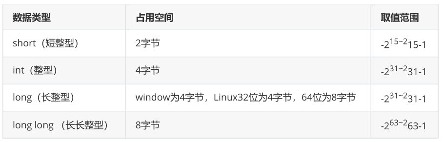
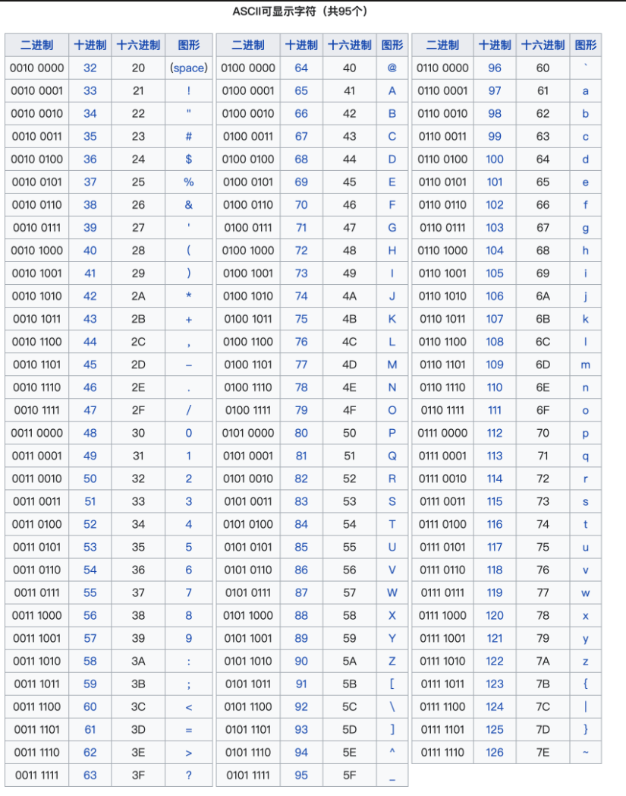
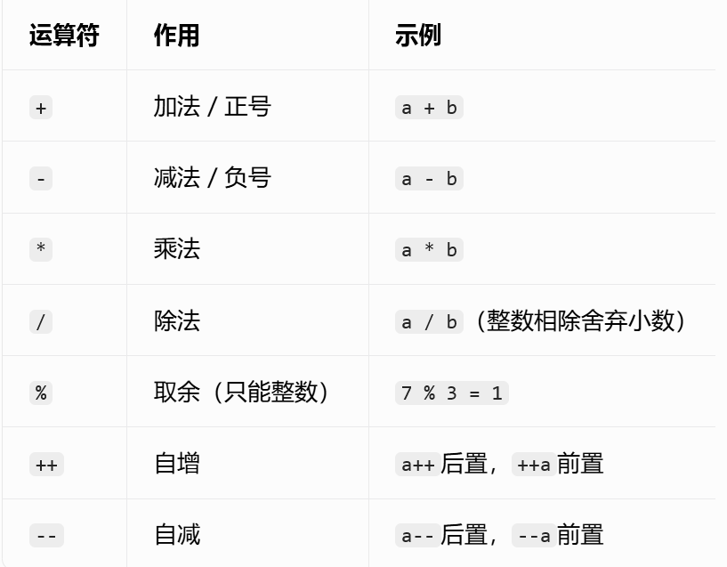
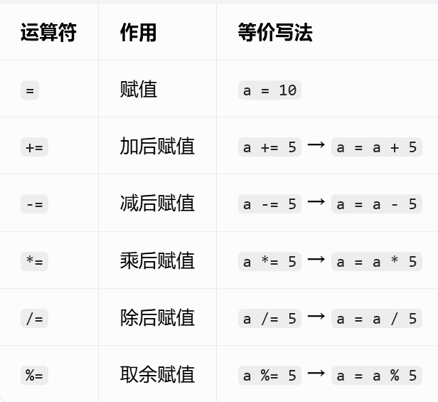
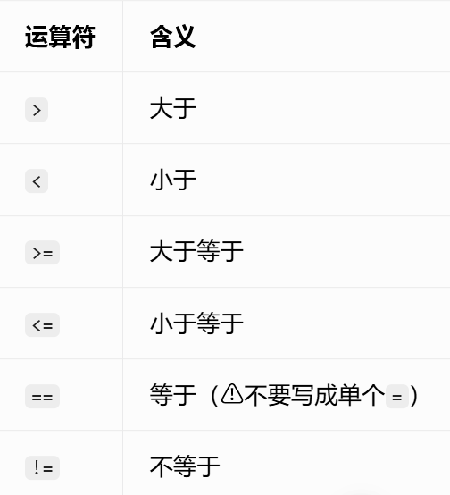
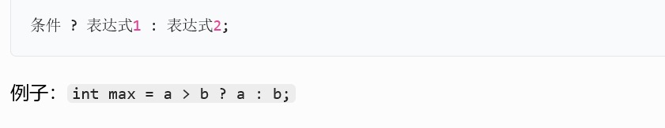
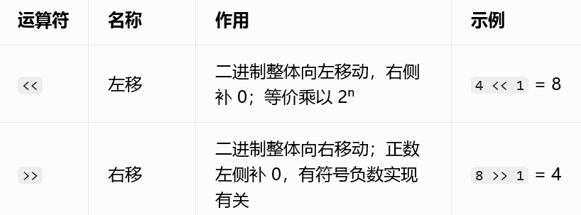
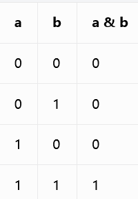
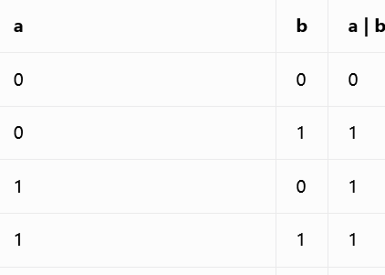
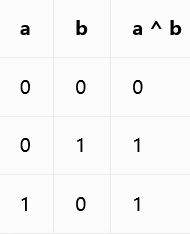

# C++自主学习  

## 1.1 C++程序示例  
```cpp  
#include<iostream>  
	int mian(){  
	std::cout<<"hello world";  
	return 0;  
}  
```  
### 1.1.1 main函数  
C++文件的扩展名为.cpp,每个C++程序中有且只有一个main()的主函数
，该函数是程序执行的入口。  
### 1.1.2 使用cout输出  
&nbsp;&nbsp;&nbsp;&nbsp;首先我们要知道`#include <iostream>`
,这个的话我习惯叫做“引入标准的输入输出流的头文件”
，cout即是向控制台或终端输出文本和数据。  
&nbsp;&nbsp;&nbsp;&nbsp;`<<`则是表示将某个数据发送给cout，该符号指出了信息流动的路径
。（后续我们还会接触到`cin`其作用表示键盘输入，逻辑与`cout`类似）  
### 1.1.3&nbsp;命名空间  
`std`是C++标准库的命名空间，包含大量常用的类，函数，对象等。  
`namespace`是一种组织代码的方式，主要用于解决命名冲突的问题。  
简单来说，你可以将 namespace 想象成一个容器或者一个范围，在这个范围内定义的变量、函数、类等
标识符不会与容器外同名的标识符产生冲突。对于大型项目或者使用多个库的情况特别有用，不会因为
使用相同的标识符而引发错误。  
### 1.1.4&nbsp;  返回语句  
`return 0`表示结束程序运行。如果在某一个函数内单独出现了`return`则表示结束这个函数  
    
### 1.1.5&nbsp;换行符  
`endl`在输出打印时我们一般用这个来表示换行

---
现在我们对C++已经有了一个初步的印象，接下我们开始来正式学习C++  

---  
  ## 2数据类型与变量定义
  ### 2.1整形  
    


  整形在这里分为**短整型**,**长整型**，**长长整形**，**整形**  
  **整形int**：4字节  
  **短整型short**：2字节  
  **长整型long**：window为4字节，Linux32位为4字节，Linux64位为8字节  
  **长长整形long long**：8字节  
  ```cpp  
  int a;
  short b;
  long long c;
  long d;

  ```
  ### 2.2浮点型  
  * 单精度 float  4字节  
*  双精度 double 8字节    
```cpp  
float a;
double b;
```
	  
### 2.3字符型  
**字符型char**  1个字节  
主要：我们字符类型是指单个的数字，字母用单引号括起来  
比如：'a' 'A' '0' '\n'
**注意：字符型可以通过ASCLL表与整形相互转换**  
```cpp
char c1='1';
char c2='a';
char c3='\n';//换行转义字符（后面会说）
```
### 2.4布尔型  
**bool**  1个字节，其返回值为true(1)或者false(0)    
```cpp  
bool flag1=true;
bool flag2=false;
bool flag3;
```
### 2.5字符串  
**string** 24个字节，不管字符串里面存的数据有多少其本身占24个字节  
```cpp
string s="1";
string s2="a";//上面这两个与字符型的区别看上去是符号不同一个为单引号一个为双引号，但究其本质，是因为字符串的结尾会自带一个\0来充当结束符号
string s3="12345";
string s4="asdfg";
string s5="张三";

```    
在C++中，它为我们提供了string类型来修饰字符串，而不是像C语言用字符数组来体现字符串。既然提到了字符串，我来说说它的一些
基本用法。  
#### 2.5.1字符串拼接  
我这边直接用代码体现  
```cpp
string s="hello";
string s2="world";
string s3=s+s2;//输出为helloworld

```


看了这段代码之后应该就对string的拼接有了一个直观的理解。除此之外，我们要注意在string的拼接概念里**只有+**没有其他符号
#### 2.5.2字符串重载  
string还重载了= > < >= <= ==这几个运算符。大家可以理解为比较两个字符串的大小关系，那么比较规则是什么呢？  
如下：  
1.	从第一个字符开始，依次对比两个字符串对应位置字符的 ASCII 数值；
2.	找到第一对不相同的字符，ASCII 更大的那整个字符串就更大，直接结束比较；
3.	如果前面字符全部相同，长度更长的字符串更大；
4.	== 要求两个字符串每个字符、长度完全一致才相等。
    
	  
   
 
 ## 3常量  
常量是程序在运行的过程中，其值不能改变的量，称之为常量。  （下面我先简单说一下常量的概念，后面还会补充指针，引用等方面的常量知识）  
  
### 3.1字面值常量  
常量分为整型常量、实型常量、字符常量、字符串常量和其他常量。  
-字符串字面量（如  "Hello" ）存储在只读的文字常量区（或称为常量池），存储在这个区域中的数据不能被程序修改。   
-整型、浮点型和其他基本类型的字面量常量通常在编译时就被嵌入到代码段中，作为指令的一部分，而不是单独分配内存。  
-其他常量：
布尔常量，一个true，一个false，两个取值。
枚举常量，枚举型数据中定义的数据也都是常量。  

### 3.2#define宏定义常量      
`#define` 宏定义实际上并不分配内存，宏定义是在编译预处理阶段由预处理器执行的文本替换操
作。也就是说，宏定义在编译过程开始之前就已经完成了文本替换，因此宏定义本身并不在程序的
运行时内存中占据任何空间。  
格式如下：  
```cpp
#define 常量名 常量值
```  
所谓文本替换就是将程序中所有出现你自己定义的**常量名**的地方自动换成**常量值**  
### 3.3const    
一句话解释就是用来修饰变量的语句，表示定义一个常量。  
```cpp
const 数据类型 常量名=常量值；//
```  
使用`const`声明的常量具有全局作用域或者是静态作用域时会存在**全局/静态存储区**。  
使用`const`声明局部变量的时候一般会根据数据类型和大小决定是分配在**栈**
上还是**常量区**  
（这些陌生的区域不用紧张下面我会讲，内存的分配贯彻了整个C++，弄清楚了内存分配就可以看懂所有程序）  
  
## 4运算符    
(比较简单，C语言都学过，这边就做个总结)
### 4.1算术运算符    

  
 ### 4.2赋值运算符
  
### 4.3关系运算符
  
### 4.4逻辑运算符
  
### 4.5三目运算符
    
### 4.6移位运算符    
  
### 4.7&，^,|  
1）&:将要比较的两个数字转换为二进制，从最后一位开始为一位对齐，如果缺少就在前面补0，接着每一位开始比较，该位都为1就为1，否则为0；
     
2）|：与上面相同，但有一个1就是1，都为0就为0；  
    
  3）^:相同为0，不同为1；
    
### 4.8优先级  
(1)  （）  
(2)++,--  
(3)算术运算符（满足数学运算规则）   
(4)移位运算符
(5)关系运算符    
(6)&,|,^
(7)&&,||  
(8)赋值运算符  
  
*以上这些是基本大类，我后来也查了一下其实有点类型里面还有点其他的，不过这些就足够了*  

## 5转义字符  
*以\开头的特殊字符，原本字符的含义被转变了，拥有了特殊功能*  
常见的：  
\n:换行  
\t:缩进  
\r:回车  
\\:\  
\":""  
\':'  
\0:空字符，字符窜结束标志  
  
## 6数组  
  
*内存当中一排连续的小格子，每个格子都存放相同的数据类型*  
*索引：可以理解为每个小格子的编号，我们用这个来访问数组元素。从0开始到数组 长度-1 结束*  
*每个格子里放的数据*
    
### 6.1格式  
```cpp
//数据类型 数组名[数组大小]；不初始化
int arr[5];
```  
```cpp
//数据类型 数组名[大小（可不写）]={。。。。} 初始化
int arr[]={1,2,3,4,5}//此时数组大小自动填充为5
int arr2[5]={1,2,3}//此时数组大小为5但大括号里面只有三个，此时会自动补0
int arr3[3]={1,2,3,4,5}//错误，数组溢出  
```  
  
### 6.2元素访问  
数组元素可以通过数组名称加索引进行访问。元素的索引是放在方括号内，跟在数组名称的后边。  
```cpp
int arr[3]={1,2,3}
int num=arr[0]//num=1
arr[1]=4//此时arr[3]={1,4,3}，说明同样可以进行赋值
```  
  
### 6.3二维数组  
（其实是支持多维数组，只不过二维就够用了）  
  
*多维数组最简单的形式是二维数组。一个二维数组，在本质上，是一个一维数组的列表*  
格式：  
```cpp
//数据类型 数组名[x][y]
int arr[3][4];//说明这个数组为3行4列
//其余的格式与一维数组一模一样

//访问，赋值
//也与一维数组一样
```    
  

为了更好阐述一维二维用法一样我来写一个
```cpp
int arr[3][4]={
{1,1,1},
{2,2,2},
{3,3,3}
}
```
```cpp
int arr[3][4]{
1,1,1,
2,2,2,
3,3,3
}
```  
上面两种完全一样，不难看出，二维数组本质还是在内存开辟了一个连续的空间。  
  
### 6.4静态数组，动态数组  
#### 6.4.1静态数组  
定义：存放在**栈**内存中的数组，它的内存空间分配与释放由系统自动完成  
  
#### 6.4.2动态数组  
定义：使用**new**关键字在**堆**内存中开辟了一个空间来存放数组，当数组使用完以后要释放，**手动分配手动释放**  
  
>本质还是数组所以用法不变，我提这个单纯是为了引出下面的内容，hihi(^-^)  
  
## 7内存分配  
作为一个中国大学生，也是在B站上看过无数教程但几乎没有人单独将程序的内存分配单独拿出来讲，我就尝试着来说明一下  
  
